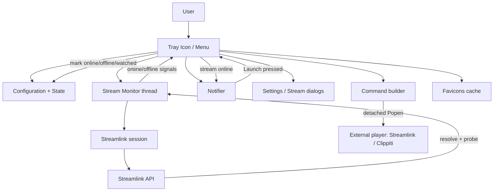
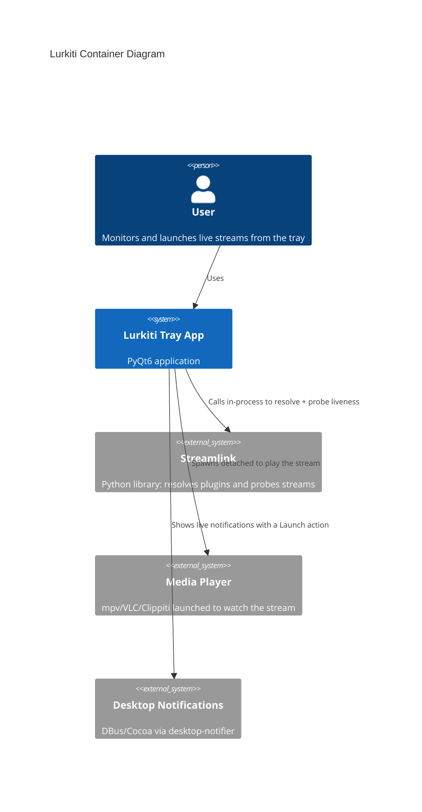

# Architecture Overview

Lurkiti is a desktop system-tray application built with PyQt6. It uses the Streamlink Python API to periodically probe configured streams for liveness, notifies the user when a stream goes live, and launches the stream in an external player (Streamlink or Clippiti) as a detached process.

## High-Level Structure

## C4-Style Container View

## Key Design Choices

- The app has no main window; the `TrayIcon` (`ui/trayicon.py`) is the composition root. It owns the `Configuration`, the `StreamMonitor` thread, the `Notifier`, and the settings/stream dialogs.
- Liveness checks run off the UI thread in `StreamMonitor` (a `QThread`). It probes **one due stream per tick** in round-robin order rather than all at once, so a large stream list never blocks or bursts, and the app stays responsive.
- Stream resolution and probing go through a single shared Streamlink session (`session.py`) that mirrors the real `streamlink` command: it loads sideloaded plugins, the user's main config, and per-plugin config files, and parses arguments with Streamlink's own CLI parser. The expensive setup (plugin load + parser build) happens once at startup and can be reloaded at runtime.
- Monitoring results are delivered to the UI as Qt signals (`stream_online(Stream, probe)` / `stream_offline(Stream)`); the tray reacts by updating its status icon, persisting per-stream state, and optionally notifying.
- Notifications are handled by `Notifier`, which drives the async `desktop-notifier` backend on a dedicated asyncio loop thread so action-button callbacks (the **Launch** button) keep working. If the backend is unavailable, the tray falls back to `QSystemTrayIcon.showMessage`.
- Players are launched **fire-and-forget**: `command.py` builds the argument list (Streamlink or Clippiti) and spawns a detached process in its own session. `SIGCHLD` is set to `SIG_IGN` so exited players are reaped by the kernel and never linger as zombies.
- Configuration and volatile runtime state are stored separately: user settings in `Lurkiti.json`, per-stream runtime state (online/last-online/last-watched timestamps) in `Lurkiti.state.json`.

## Core Runtime Artifacts

- Config file: `<config-dir>/Lurkiti.json` (or `--config <path>`)
- State file: `<state-dir>/Lurkiti.state.json`
- Favicon cache: `<cache-dir>/favicons/<type>_<size>x<size>.png`
- Player launch logs (transient): `<tmp>/lurkiti/*.log`

See [Configuration and CLI](configuration-and-cli.md) for the exact locations per platform.
