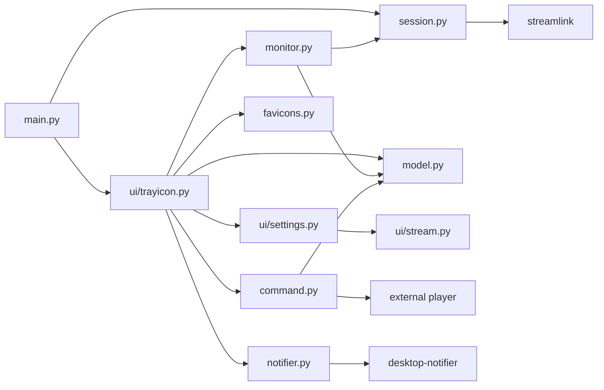

# Module Reference

## Entry and Composition

- `src/lurkiti/main.py`
- Responsibilities:
  - CLI parsing (`-c/--config`, `-l/--log-level`, `--denoise-logging`)
  - logging setup and a `QMessageBox`-based `excepthook`
  - `QApplication` creation and app metadata
  - child-reaping setup (`configure_child_reaping`)
  - one-time Streamlink load (`load_sl_user_stuff`)
  - creates and shows the `TrayIcon`

## Model Layer

- `src/lurkiti/model.py`
- Responsibilities:
  - enums: `TrayIconStatus`, `TrayIconAction`, `NotifyMode`
  - Pydantic models: `Stream`, `Geometry`, `ConfigModel`, `StreamState`, `StateModel`
  - `Configuration` (`QObject`): loads/saves the JSON config and the separate state file, exposes typed property accessors, stream CRUD (`get_stream`/`set_stream`/`del_stream`), per-stream state updates (`mark_stream_online`/`offline`/`watched`), and window geometry persistence. Emits `config_changed` / `state_changed`.

## Services / Helpers

- `src/lurkiti/session.py`
  - Shared in-process Streamlink session with a non-interactive input requester. Builds and caches the Streamlink CLI parser, loads sideloaded plugins and the user's main/per-plugin config (`load_sl_user_stuff`), and probes liveness via `is_stream_live`, returning a `StreamProbe` (plugin, liveness, and live metadata: title/author/category). Behavior matches the real `streamlink` command.
- `src/lurkiti/command.py`
  - Builds launch commands and spawns players. `build_launch_command` chooses between `_build_streamlink_command` and `_build_clippiti_command`; `launch_process` runs the player detached (own session, transient temp logs) and runs `streamlink` as `python -m streamlink`. Includes `configure_child_reaping` (`SIGCHLD`→`SIG_IGN`), quality resolution, and argument merge/parse helpers.
- `src/lurkiti/monitor.py`
  - `StreamMonitor` (`QThread`): round-robin, interval-throttled liveness checks; forces `always_on` streams live; emits `stream_online(Stream, probe)` / `stream_offline(Stream)`; supports `pause`/`resume`/`stop`; exposes live/vip counts and sorted stream lists for the menu.
- `src/lurkiti/notifier.py`
  - `Notifier` (`QObject`): desktop notifications via `desktop-notifier`, driven on a dedicated asyncio loop thread so the **Launch** action button works. Emits `launch_requested(Stream)`; supports persistent (critical, no-timeout) notifications and clean `shutdown`.
- `src/lurkiti/favicons.py`
  - Qt-aware favicon fetch-and-cache (singleton `favicons`, helpers `get_stream_icon` / `get_stream_icon_path`). Discovers site icons with `requests` + BeautifulSoup, caches scaled PNGs (16/24 px) under the cache dir, and returns `QPixmap`s for the menu.

## UI Layer

- `src/lurkiti/ui/trayicon.py`
  - `TrayIcon` (`QSystemTrayIcon`): composition root. Resolves the config path, builds the `Configuration`, `SettingsWindow`, `Notifier`, and `StreamMonitor`; renders status icons (off/idle/live/vips) and a dynamic context menu (always-on vs. currently-live streams); handles left-click action, online/offline reactions, notifications, monitoring/notification toggles, clipboard-URL launch, settings, and quit.
- `src/lurkiti/ui/settings.py`
  - `SettingsWindow` (`QWidget`): tabbed settings UI. `StreamListModel` (`QAbstractItemModel`) + `StreamTreeNode` present the configured streams as a tree for add/edit/clone/delete and global option editing.
- `src/lurkiti/ui/stream.py`
  - `StreamDialog` (`QDialog`): add/edit/clone a single stream with its per-stream overrides (quality, player, Streamlink/player args, notify mode, always-on).

## Dependency Direction

