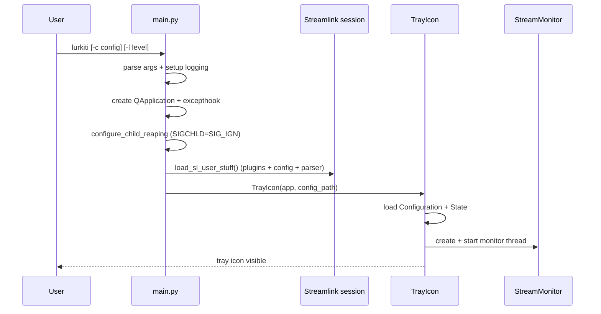
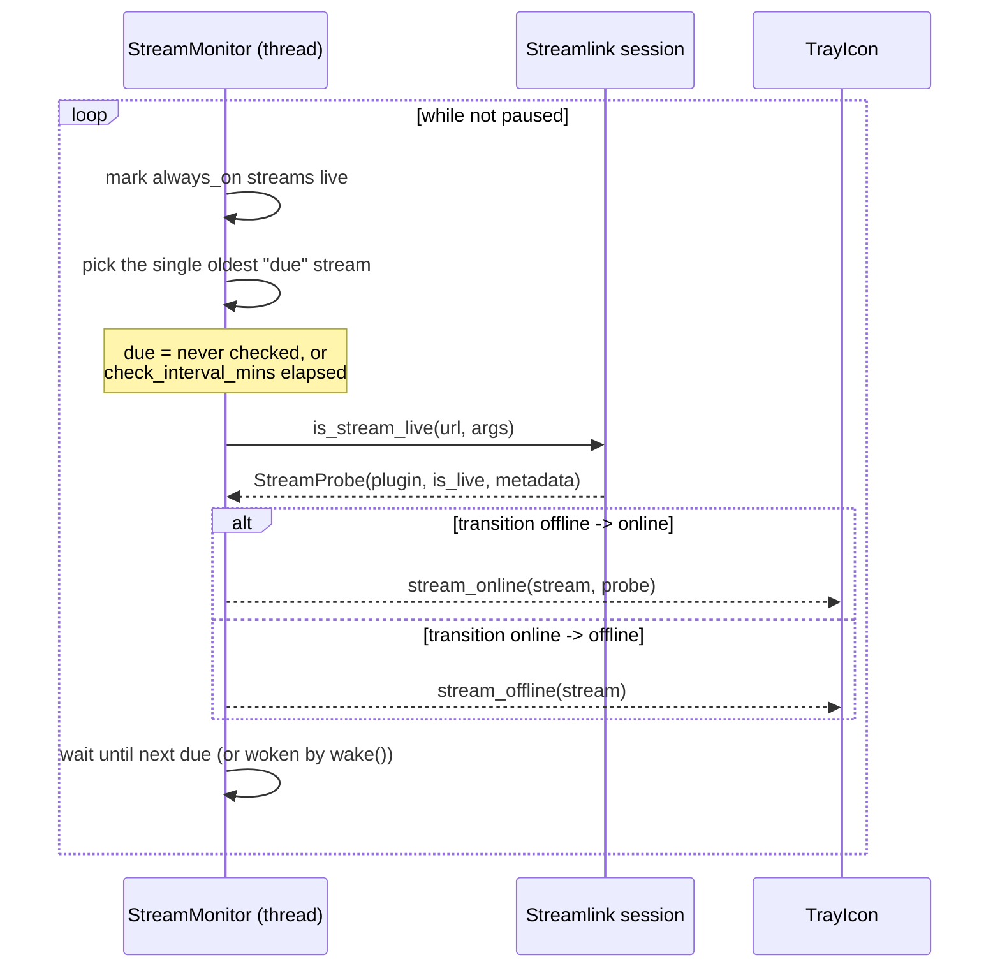
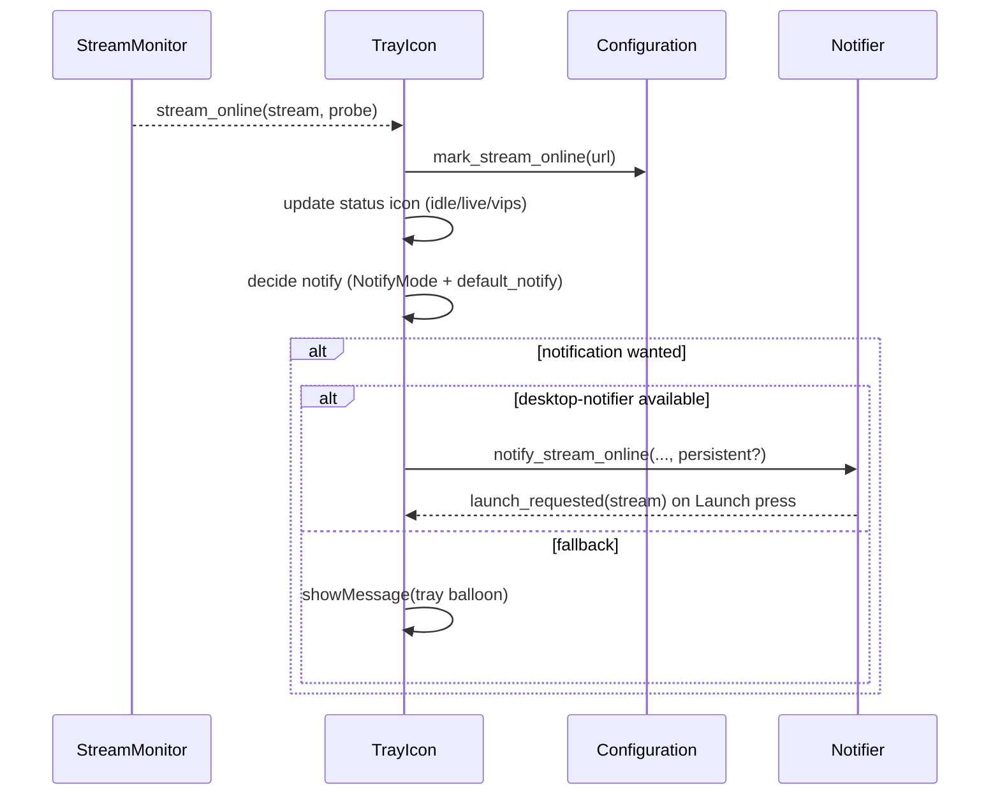
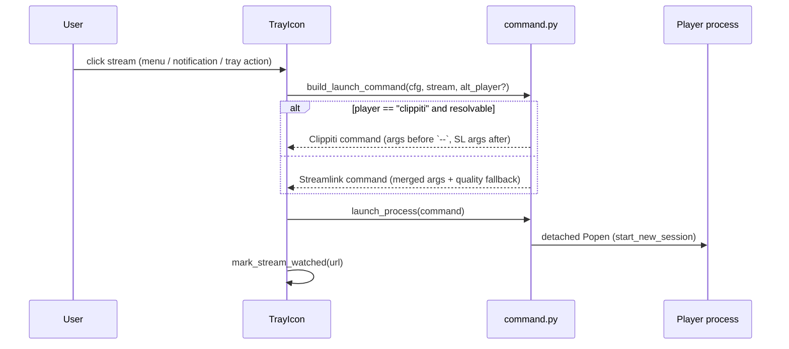
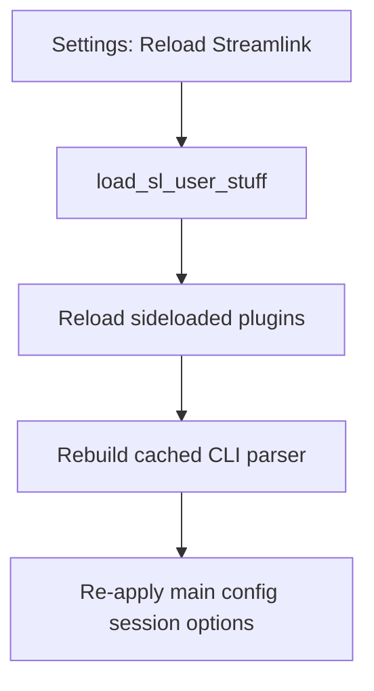
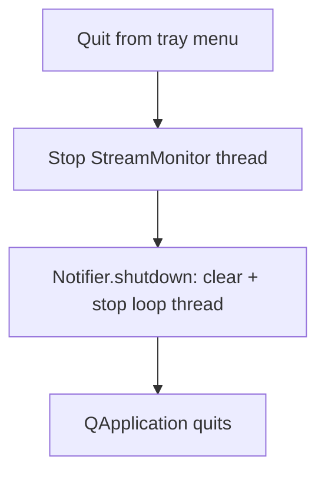

# Runtime Workflows

This document summarizes the main application workflows.

## 1. Startup

If no `--config` is given, the config path defaults to `<config-dir>/Lurkiti.json`.

## 2. Monitoring Loop

The loop is event-driven: it sleeps until the next stream is due (via a
`threading.Event`) and is woken immediately on `pause`/`resume`/`stop` and on any
configuration change (`config_changed`, e.g. an `always_on` toggle or interval
edit). Only one stream is probed per iteration, throttled by `check_interval_mins`,
so idle CPU is effectively zero between checks.

## 3. Going Live and Notification

Per-stream `notify` (`default`/`no`/`yes`/`persistent`) overrides the global `default_notify`. `persistent` uses a critical-urgency notification with no timeout.

## 4. Launching a Stream

`streamlink` is launched as `python -m streamlink` so the bundled/virtualenv copy is used. Quality resolves to the stream (or default) quality with `best` appended as a fallback.

## 5. Reloading Streamlink

This picks up newly added plugins or config changes without restarting the app.

## 6. Shutdown

